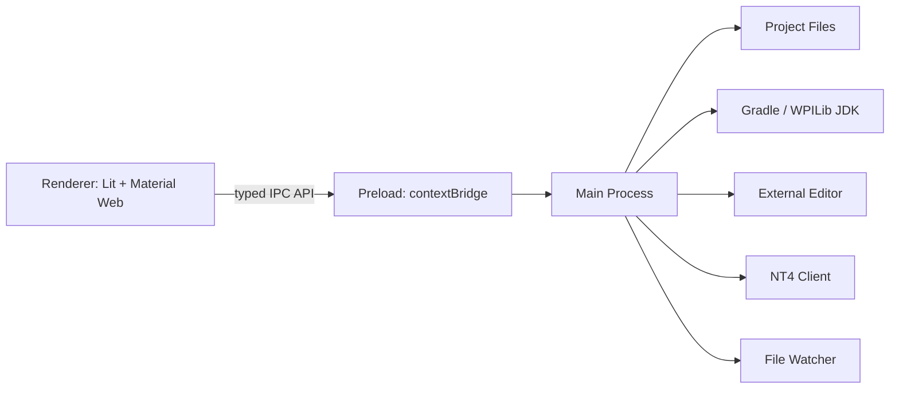

# FRC Framework 开发规划

> 文档状态：初版总体规划
> 产品暂定名：**FRC Framework**
> 目标平台：Windows、macOS、Linux
> 技术方向：Node.js + TypeScript + Electron + Web UI + Google Material Design 3

## 1. 产品定义

FRC Framework 是一个面向 FRC 机器人项目的结构化工程工具。它不是用于取代 Java、WPILib 或 IDE 的“低代码平台”，而是在正常、清晰、可独立维护的 Java 项目上增加一层可视化工程模型。

软件负责管理适合结构化表达的内容，例如：

- 机器人、Subsystem、Mechanism、Device、Command 和状态的层级关系；
- CAN ID、总线、反向、跟随、限流、减速比、软限位、PID、前馈、Motion Magic、仿真参数等；
- 主操/副操、按钮、轴、POV、Trigger 条件和 Command 绑定；
- NetworkTables 可调参数及其路径；
- Swerve、Limelight 等预制模块；
- 跨文件引用、依赖注入、RobotContainer 装配；
- 项目文档、硬件表、控制表和供 AI 阅读的 `AGENTS.md`；
- 构建、仿真、部署、外部编辑器跳转和变更检查。

复杂算法、特殊控制流程以及不能可靠结构化的 Java 逻辑仍由开发者在 IDE 中编写。没有安装 FRC Framework 的人，也应当能直接打开生成项目、理解代码、编译、部署和继续开发。

## 2. 产品目标与非目标

### 2.1 核心目标

1. **代码优先且可脱离软件**：生成标准 GradleRIO/WPILib Java 工程，不依赖 FRC Framework 才能运行。
2. **结构清晰**：每类配置、装配、运行逻辑和遥测都有稳定的位置和边界。
3. **双向适配**：优先读取 `project.yaml`；缺失时可分析现有代码并尽量恢复结构化模型。
4. **不破坏手写代码**：不能理解的代码标记为自定义内容并保留，不静默覆盖。
5. **新手和老手都高效**：常用模块可快速创建，高级用户仍能自由进入 Java 完成复杂实现。
6. **充分利用 IronPulse Lib**：优先生成基于已有 `lib.ironpulse` 封装的简洁设备和机制定义。
7. **直观易用**：首次打开无需教程即可理解“项目树—属性—代码—验证—运行”的主流程。
8. **跨平台**：同一工程文件和核心功能在 Windows、macOS、Linux 上保持一致。

### 2.2 明确非目标

- 不制作完整 Java IDE，不在应用内重新实现 VS Code/IntelliJ。
- 不把所有 Java 逻辑转换成节点图。
- 不强制整个机器人采用统一的全局状态机。
- 第一版不创建新的通用机器人状态机运行库。
- 不替代 AdvantageScope 的日志、图表、3D 场地等分析能力。
- 不承诺无损理解任意风格、任意复杂度的第三方 Java 项目；无法理解时采用降级显示。
- 不把 `project.yaml` 变成 Java 源码的逐行镜像。

## 3. 核心设计原则

### 3.1 单一结构化模型，多个输出

`project.yaml` 是可视化部分的主要结构化模型。软件从它生成或更新：

- 受管理的 Java 配置与装配代码；
- NetworkTables 元数据；
- 英文项目文档；
- 根目录唯一的 `AGENTS.md`；
- UI 中的项目树、属性面板、验证信息和差异预览。

复杂 Java 实现仍以 `.java` 文件为准。模型只记录软件能够明确理解和安全修改的内容。

### 3.2 三种代码所有权

每段内容必须属于以下一种类型：

| 类型 | 含义 | 软件行为 |
| --- | --- | --- |
| Managed | 完全由结构化模型生成 | 可重建，但修改前显示 Diff |
| Recognized | 软件可识别的标准 Java 写法 | 可读取和进行精确的小范围编辑 |
| Custom | 任意手写或无法可靠理解的逻辑 | 只索引、显示摘要、打开 IDE，不自动重写 |

受管理文件应优先使用“一个职责一个文件”的方式生成，减少在同一文件中混合模板和手写逻辑。确需混合时使用稳定的 managed region 标记，并允许格式化工具正常处理。

### 3.3 所有写入都可预览、可恢复

一次 UI 操作形成一个事务：

1. 在内存模型上应用变更；
2. 完成 Schema 和语义验证；
3. 生成候选 `project.yaml`、Java 和文档；
4. 显示文件级与行级 Diff；
5. 用户确认后写入临时文件；
6. 原子替换目标文件并留下可恢复备份；
7. 运行格式化和可选编译；
8. 失败时恢复文件和模型。

对于无风险、频繁的小修改，可提供“自动应用”设置，但仍必须保留操作历史和撤销能力。

### 3.4 Java 必须符合人的直觉

- 使用明确的类名、变量名、构造参数和正常 Java import。
- 不生成隐藏控制流、反射式运行框架或难以追踪的注册机制。
- 跨 Subsystem 行为优先通过 `RobotCommands` 或明确的构造依赖组合。
- Config 保存常量和硬件参数；Factory 负责 Real/Sim 实例创建；Subsystem 负责运行行为。
- 生成代码接受 Spotless/Google Java Format，并在无软件环境下正常编译。

## 4. 用户工作流闭环

### 4.1 创建项目

1. 用户选择一个空文件夹。
2. 首页识别为空目录并启用“创建项目”。
3. 用户填写项目名、Team Number、Java Package、WPILib 年份和目标模式。
4. 软件从内置的唯一优化 Base 创建标准工程。
5. 创建初始 `project.yaml`、英文 docs 和 `AGENTS.md`。
6. 自动执行验证和首次 Gradle 编译。
7. 进入项目工作区。

### 4.2 打开项目

1. 用户选择已有文件夹。
2. 软件先检查 `project.yaml`。
3. 存在时：校验版本、迁移模型、检查代码与模型是否漂移。
4. 不存在时：扫描 `build.gradle`、vendordeps 和 Java 源码，建立导入预览。
5. 用户确认识别结果后生成 `project.yaml`，不改写未知 Java 逻辑。
6. 工作区持续监听外部编辑器的文件修改并增量刷新。

### 4.3 编辑硬件或模块

1. 在项目树中选择 Subsystem、Mechanism 或 Device。
2. 属性面板只显示该组件支持的参数。
3. 常用参数默认出现，高级和可选参数通过搜索或“添加参数”启用。
4. 保存前实时检查 CAN ID、单位、范围、依赖和路径冲突。
5. 生成变更预览，同时更新 YAML、Java 和相关文档。
6. 可直接编译、仿真或部署。

### 4.4 编写复杂代码

1. 在项目树选择类、Command、状态或绑定。
2. “代码”菜单提供：在外部编辑器打开、添加引用/import、添加局部状态/Goal 框架。
3. 软件按照已保存的编辑器可执行文件和参数模板跳转到文件、行和列。
4. 用户修改后，文件监听器重新解析。
5. 可识别内容同步回 UI；复杂内容显示为 Custom，并给出摘要与“在代码中调试”。

### 4.5 NT 调参与回写

1. 连接机器人或模拟器的 NT4 服务。
2. 只订阅项目中声明的可调参数路径及必要元数据。
3. 页面比较“代码默认值”和“NT 当前值”。
4. 只显示有差异的项目，可筛选、逐项选择。
5. 点击“将 NT 值写回代码”。
6. 软件更新 `project.yaml` 和对应 Java 默认值，显示 Diff。
7. 格式化和编译通过后，可选继续部署。

## 5. 信息架构与界面

### 5.1 主界面布局

采用稳定的三栏工作区，降低学习成本：

```text
┌──────────────── Top App Bar ──────────────────────────┐
│ Project | Validate | Build | Simulate | Deploy | More │
├──────────────┬────────────────────────┬────────────────┤
│ Navigation   │ Project Tree / Editor  │ Inspector      │
│ Rail         │ Main Content           │ Properties     │
│              │                        │                │
├──────────────┴────────────────────────┴────────────────┤
│ Problems / Diff / Build Output / NT Changes           │
└───────────────────────────────────────────────────────┘
```

- 左侧 Navigation Rail：Project、Controls、Commands、Auto、NT、Docs、Problems、Settings。
- 中部：层级树、表格、表单、Diff 或模块向导。
- 右侧 Inspector：所选对象属性和快速操作。
- 底部面板：Problems、Diff、Build Output、运行状态。
- 窄屏时 Inspector 和底部面板转为 Drawer/Sheet，不牺牲主要工作流。

### 5.2 项目树的两种视图

**逻辑视图**面向机器人结构：

```text
Robot
├─ Drivetrain
│  ├─ Swerve Module FL
│  │  ├─ Drive Motor
│  │  ├─ Steer Motor
│  │  └─ CANcoder
│  └─ Gyro
├─ Shooter
│  ├─ Upper / Drum
│  │  ├─ Main Motor
│  │  └─ Follower Motors
│  ├─ Lower / Feed
│  ├─ Hood
│  └─ Shot Calculator
├─ Commands
├─ Controls
├─ Auto
└─ Telemetry
```

**源码视图**显示标准文件树，并标明 Managed、Recognized、Custom、错误和外部修改状态。

### 5.3 Material Design 3 实施约束

UI 标准控件使用 Google 官方 [`@material/web`](https://material-web.dev/)：Button、Icon Button、Text Field、Select、Checkbox、Switch、Tabs、Dialog、Menu、List、Progress、Snackbar 等。Material Web 使用 Material Design 3，但其官方仓库目前标注为 maintenance mode，因此采用以下策略：

- 固定精确版本，不使用不受控的浮动版本；
- 建立很薄的 `ui/material` 适配入口，业务页面不散落直接版本依赖；
- 标准交互控件不自行绘制，也不引入另一套视觉组件库；
- 树、分栏、Diff 等 Material Web 未提供的复合工作区，仅编写布局和业务组合，内部交互元素继续使用官方 `md-*` 控件和 Material tokens；
- 使用官方 Material Symbols；字体优先随应用打包，保证离线一致性；
- 主题只使用黑、炭灰、中性灰和白，状态色仅用于成功、警告、错误和连接状态；
- 保留清晰 focus ring、键盘导航、ARIA 标签和足够对比度；
- 动效短、克制，并遵从系统“减少动态效果”设置。

### 5.4 双语规则

- UI 支持简体中文和英语，首次启动跟随系统语言，可在设置中切换。
- 所有显示文本使用 key，不在组件内写死中文或英文。
- 数值、单位和快捷键按照平台与语言本地化。
- Java package、类名、变量名、注释、自动生成 docs、`AGENTS.md` 固定使用英语。
- 项目里的用户补充文档不限制语言。

## 6. 推荐技术架构

### 6.1 技术栈

| 层 | 选择 | 说明 |
| --- | --- | --- |
| 桌面运行时 | Electron | Windows/macOS/Linux 一套代码 |
| 脚手架与打包 | Electron Forge | 创建、打包、Maker、签名流程 |
| 构建 | Vite | Main、Preload、Renderer 快速开发构建 |
| 语言 | TypeScript strict | 共享领域模型和 IPC 类型 |
| Web 渲染 | Lit | 与 Material Web 的 Web Components 模式自然配合 |
| UI | `@material/web` | Google 官方 Material Design 3 组件 |
| 项目格式 | YAML + JSON Schema | 人可读、可版本迁移、可验证 |
| Java 分析 | Tree-sitter Java WASM | 容错解析，避免各平台原生模块打包差异 |
| 文件监听 | Chokidar | 监听 IDE 外部修改 |
| 测试 | Vitest + Playwright | 单元、集成和 Electron E2E |
| Java 格式化 | 项目 `spotlessApply` | 最终格式与机器人仓库规范一致 |
| 发布 | Forge Makers + CI | 平台安装包与校验文件 |

构建时 Node.js 使用与选定 Electron/Forge 兼容的当前 LTS，并通过版本文件锁定。包管理建议使用 pnpm，并提交 lockfile。

### 6.2 Electron 进程边界



安全基线：

- `contextIsolation: true`；
- `nodeIntegration: false`；
- Renderer sandbox 开启；
- Renderer 不直接访问文件系统、进程或 shell；
- Preload 只暴露明确、最小、带类型的 IPC 方法；
- Main 校验每个项目路径是否仍位于已授权根目录；
- 外部程序使用 `spawn(executable, args, { shell: false })`，不拼接 shell 字符串；
- 禁止把任意 IPC channel 直接透传给 Renderer；
- 默认不加载远程页面，设置严格 CSP。

### 6.3 Monorepo 目录建议

```text
frc-framework/
├─ apps/
│  └─ desktop/
│     ├─ src/main/
│     ├─ src/preload/
│     └─ src/renderer/
├─ packages/
│  ├─ domain/             # Project model, commands, validation
│  ├─ project-io/         # YAML, migration, transaction, watcher
│  ├─ java-parser/        # Java index and recognized patterns
│  ├─ code-generator/     # Base, modules, managed Java/docs
│  ├─ frc-catalog/        # IronPulse/WPILib component metadata
│  ├─ nt-client/          # NT4 connection abstraction
│  ├─ toolchain/          # Gradle, JDK, build/sim/deploy/editor
│  ├─ i18n/               # zh-CN/en resources
│  └─ test-fixtures/      # Sample projects and golden outputs
├─ resources/
│  ├─ base-template/
│  ├─ icons/
│  └─ project.schema.json
├─ docs/
├─ DEVELOPMENT_PLAN.md
└─ TODO.md
```

### 6.4 领域服务边界

- **ProjectService**：打开、创建、关闭、最近项目。
- **ModelService**：领域模型读取、命令应用、撤销/重做。
- **SchemaService**：YAML Schema、默认值、版本迁移。
- **JavaIndexService**：类、方法、import、Command、绑定、managed region 索引。
- **GenerationService**：Java、文档、模板和模块生成。
- **TransactionService**：候选输出、Diff、原子写入、恢复。
- **ValidationService**：跨模型和源码的语义检查。
- **ToolchainService**：WPILib JDK、Gradle、Spotless、simulate、deploy。
- **EditorService**：编辑器检测、配置与文件定位跳转。
- **NtService**：NT4 连接、订阅、差异、回写。
- **PresetService**：预制模块创建、版本和升级 Diff。
- **DocumentationService**：英文 docs 和 `AGENTS.md`。

## 7. `project.yaml` 模型设计

### 7.1 文件职责

`project.yaml` 记录软件可管理的事实，而不是所有源代码。建议顶层结构：

```yaml
schemaVersion: 1
project:
  name: ExampleRobot
  teamNumber: 10541
  wpilibYear: 2026
  language: java
  package: frc.robot
  baseVersion: 1.0.0

tooling:
  javaFormatter: spotless
  preferredEditor: wpilib-vscode

robot:
  mode: real-sim
  canBuses: []
  subsystems: []
  superstructures: []

controls:
  devices: []
  bindings: []

commands: []
autonomous: {}
telemetry: {}
networkTables:
  defaultRoot: /Tuning

presets: []
documentation: {}
ownership: {}
```

实际 Schema 在开发时拆成可测试的定义，并给每个实体稳定 UUID。Java 名称允许重命名，但引用通过 UUID 维护，生成时再解析为 Java symbol。

### 7.2 Subsystem、Mechanism 和 Device

- **Subsystem**：WPILib 调度和资源所有权边界。
- **Superstructure**：跨多个 Subsystem 的高层协调概念，可以只生成普通 Java 协调类。
- **Mechanism**：Subsystem 内的功能结构，例如 Shooter Upper、Feed、Hood。
- **Device**：Motor、Encoder、Gyro、Sensor、LED、Camera 等硬件或 Sim IO。
- **Follower**：显式关联主设备，仍保留独立 CAN ID 和反向选项。

每个节点可关联源文件、Java symbol、配置来源、NT 路径、文档说明和验证结果。

### 7.3 组件目录与可选参数

`frc-catalog` 不是写死表单，而是组件元数据目录。每种组件声明：

- 对应的 IronPulse/WPILib/Phoenix 类；
- 构造参数和 Builder 能力；
- 参数类型、默认值、单位、范围和互斥条件；
- Real/Sim 支持；
- 所需 vendordep/import；
- 可生成的 NT 调试项；
- 文档链接和迁移规则。

电机参数至少覆盖：

- CAN ID、CAN bus、设备名称；
- inversion、neutral mode、sensor direction；
- follower 与 oppose direction；
- supply/stator current limit；
- open/closed-loop ramp；
- rotor-to-sensor、sensor-to-mechanism ratio；
- remote CANcoder 和 feedback source；
- forward/reverse soft limit；
- zeroing、home position、允许范围；
- PID slots、kP/kI/kD、kS/kV/kA/kG；
- Motion Magic cruise velocity、acceleration、jerk；
- tolerance、setpoints、continuous wrap；
- simulation inertia、gearing、friction、limits；
- telemetry/NT 发布和可调开关。

UI 默认只显示身份和常用配置。“添加参数”通过搜索选择高级能力；未选参数不生成无意义的 Builder 调用。

## 8. 优化 Base 工程

应用只维护一个基础模板。模板必须做到：

- 空项目即可通过 Gradle 编译；
- 使用正常 WPILib `Main`、`Robot`、`RobotContainer` 生命周期；
- 包含 `lib.ironpulse` 并保持其封装可直接使用；
- 正确设置 `src/ext` 及 NT 注解处理器；
- 提供 AdvantageKit、Phoenix、PathPlanner 所需的基础依赖和最小初始化；
- 具备 Real/Sim 创建入口；
- 具备 OI、Auto、Telemetry 的空骨架；
- 不把 Swerve、Limelight 等具体机器人模块塞入基础模板；
- 目录、命名和注释能够作为生成代码的示范；
- 标明哪些文件由软件管理、哪些文件留给用户。

建议生成后的机器人包结构：

```text
frc.robot
├─ Main.java
├─ Robot.java
├─ RobotContainer.java
├─ RobotConstants.java
├─ oi/
│  └─ OperatorInterface.java
├─ commands/
│  └─ RobotCommands.java
├─ subsystems/<name>/
│  ├─ <Name>Config.java
│  ├─ <Name>Factory.java
│  └─ <Name>Subsystem.java
├─ auto/
│  ├─ AutoManager.java
│  ├─ AutoActions.java
│  ├─ AutoRoutines.java
│  └─ AutoParams.java
├─ field/
│  ├─ FieldConstants.java
│  ├─ FieldPublisher.java
│  └─ RobotStateRecorder.java
└─ telemetry/
   ├─ RobotTelemetry.java
   ├─ RobotMechanism3d.java
   └─ FieldCoreBridge.java
```

`RobotContainer` 只装配顶层对象，目标保持约 50–100 行。具体输入绑定放入 `OperatorInterface`，跨系统 Command 组合放入 `RobotCommands`。

## 9. Java 生成、解析与外部修改

### 9.1 生成规则

- 输出顺序确定：同一模型重复生成必须得到相同内容。
- import 自动去重和排序，不使用通配符 import。
- 生成类、字段和方法有稳定命名规则，可在 UI 预览。
- 所有物理量明确单位，优先使用 WPILib Units 或在名称中表达单位。
- 配置类不包含周期运行逻辑。
- Factory 负责 `RobotBase.isReal()` 或等价 Real/Sim 分支。
- Subsystem 不直接创建其他 Subsystem。
- 每次生成后运行项目自己的 Spotless，而非应用私自决定 Java 格式。

### 9.2 从代码回读

导入器分层工作：

1. 识别 GradleRIO、WPILib 年份、package 和 vendordeps。
2. 建立 Java 文件、类型、字段、方法、import 和调用关系索引。
3. 识别 IronPulse 的标准 Config/Factory/Subsystem 写法。
4. 识别常见 Controller、Trigger 和 Command binding。
5. 识别 enum Goal/State 及简单 setter/command 包装。
6. 无法确认的表达式保留为源码片段和 Custom 节点。

UI 必须显示识别置信度：完全识别、部分识别、自定义。部分识别项可查看软件理解到的内容和原始源码位置。

### 9.3 外部变更冲突

- 文件监听发现变化后，先判断是否为应用自身写入。
- 用户在 IDE 修改受管理文件时，重新解析并比较模型。
- 能安全吸收的变更提供“同步到模型”。
- 无法吸收的变更提供“保留代码并解除管理”或“用模型重新生成”的明确选择。
- 绝不在后台静默覆盖冲突文件。

## 10. Subsystem、Command 与状态模型

### 10.1 三种 Subsystem 工作模式

每个 Subsystem 可独立选择：

1. **Direct Command**：Command 直接调用公开方法，适合简单机构。
2. **Goal-driven**：Subsystem 保存期望 Goal，`periodic()` 或控制方法根据 Goal 输出，适合 Shooter、Arm 等持续控制机构。
3. **Custom Java**：软件只管理设备和配置，运行逻辑完全交给用户。

### 10.2 Goal、Status 和 Command 的区别

- **Goal**：期望状态，例如 `SPEAKER_SHOT`、`STOW`。
- **Status**：从传感器得到的实际状态，例如 `AT_SPEED`、`JAMMED`。
- **Command**：具有调度、条件、超时和结束规则的动作过程。

不要把这三者合成一个全局 enum。软件只提供可选的普通 Java 脚手架，例如：

- 局部 enum；
- 当前 Goal 字段；
- getter/setter；
- `setGoalCommand(...)`；
- AdvantageKit 状态记录；
- 可选的合法转换验证。

第一版不引入新的通用状态机 lib。Robot 级协调优先使用清晰的 `RobotCommands` command compositions；只有确实持续协调多个 Subsystem 时才创建 Superstructure 类。

### 10.3 跨 Subsystem 引用

界面中的“添加引用”按目标类型执行正常 Java 操作：

- 静态工具：添加 import 并直接调用；
- 另一个 Subsystem：添加 import、构造字段、构造参数，并在 `RobotContainer` 注入；
- Command 工厂：添加 import，并验证 requirements；
- 跨系统动作：建议生成到 `RobotCommands`，避免 Subsystem 相互持有形成循环。

变更前显示涉及的所有文件。依赖图检测循环，并提出移动到 `RobotCommands` 或 Superstructure 的建议。

## 11. Controls 与 RobotContainer

### 11.1 输入设备模型

支持预设与自定义并存：

- Xbox Controller；
- PS4/PS5 Controller；
- Joystick/Flight Stick；
- Button Board；
- GenericHID；
- 模拟键盘；
- NT 输入；
- Custom Java input。

设备包含 port、role、deadband、axis transform、rumble 和显示名称。role 可为 driver、operator、technician 或用户自定义。

### 11.2 绑定模型

可视化绑定支持：

- `onTrue`、`onFalse`、`whileTrue`、`toggleOnTrue` 等 WPILib 语义；
- button、axis threshold、POV；
- 多键 chord；
- 逻辑条件和机器人模式条件；
- Command 参数和中断行为。

如果用户在 Java 写了复杂压力曲线、动态 Trigger 或任意表达式，解析器应展示“已检测到自定义输入逻辑”、涉及设备和源码位置，而不是假装能完整编辑。

### 11.3 Command 发现与安全

- 索引公开 Command 工厂方法和已生成 Command 定义。
- 显示参数、requirements、是否可重复创建。
- 绑定时生成新的 Command 实例或工厂调用，避免错误复用已被组合的 Command 实例。
- 检测同一按键冲突、重复绑定和潜在 requirements 冲突。

## 12. 预制模块系统

预制模块不是一段代码片段，而是可实例化、可升级、可修改的完整包：

- 模块 Schema 与向导；
- 依赖和 vendordeps；
- Config/Factory/Subsystem；
- Real/Sim 实现；
- 常用 Commands；
- NT 参数元数据；
- 验证器；
- 英文文档；
- 校准步骤；
- 允许用户扩展的边界；
- preset 版本和迁移说明。

第一批预制模块：

1. **Swerve**：模块几何、Drive/Steer/CANcoder、Gyro、offset、Real/Sim、默认 drive command、odometry、PathPlanner 接入、校准检查。
2. **Limelight**：设备名、NetworkTables、机器人到相机 Transform、pipeline、目标/位姿读取、时间戳和无目标处理、Sim/断线降级。
3. 后续候选：单电机机制、位置控制机制、速度控制飞轮、双电机 follower、BeamBreak 输送链、LED Indicator。

用户实例化后得到普通 Java 文件，可以自由修改。预制升级必须通过三方比较或 Diff 合并，不静默覆盖。

## 13. NetworkTables 调参

### 13.1 页面定位

NT 页面只负责：

- 连接状态；
- 显示哪些可调值与代码默认值不同；
- 选择并将运行值写回项目；
- 显示路径、类型、时间和来源。

图表、日志和复杂可视化继续交给 AdvantageScope。可提供“在 AdvantageScope 打开/连接”的快捷入口，但不复制其功能。

### 13.2 参数发布与路径

- 每个支持的参数可勾选“发布到 NT”和“允许调节”。
- 默认路径由 `/Tuning/<Subsystem>/<Mechanism>/<Parameter>` 自动生成。
- 用户可修改全局 root、模块路径或单项完整路径。
- 校验路径重复、类型冲突和非法字符。
- 订阅应按声明的前缀进行，避免全量拉取。

### 13.3 回写规则

- 同时显示 Code Default、Live NT、Delta。
- 浮点比较有可配置 tolerance，避免噪声造成假差异。
- 类型、单位或范围不匹配时禁止回写并说明原因。
- 多项回写作为一个事务，更新 YAML、Java 和 docs。
- 回写后运行 Diff、Spotless 和 compile；部署必须是额外的明确操作。
- 第一阶段先完成 NT4 协议和跨平台实现的技术验证，并研究 AdvantageScope 的连接体验；只参考交互和公开协议，不直接复制不兼容许可代码。

## 14. 文档与 AI 上下文

项目根目录只生成一个英文 `AGENTS.md`，内容保持短小，作用是：

- 说明项目由 FRC Framework 管理的范围；
- 指引 AI 先阅读哪些 docs；
- 说明代码结构、生成边界和修改规范；
- 提醒不要覆盖 managed regions 或绕过 `project.yaml`；
- 列出格式化、测试、仿真和部署命令。

自动生成的英文文档：

- `docs/ROBOT_OVERVIEW.md`
- `docs/HARDWARE_MAP.md`
- `docs/SUBSYSTEMS.md`
- `docs/CONTROL_BINDINGS.md`
- `docs/STATE_MODEL.md`
- `docs/CODE_STYLE.md`
- `docs/SAFETY.md`

每份文档分为生成区和用户补充区。软件更新生成区时保留用户补充；UI 中可编辑补充内容，并提示最终内容仍是普通 Markdown。

## 15. 验证、诊断与工具链

### 15.1 静态验证

至少覆盖：

- CAN ID 和 CAN bus 冲突；
- DIO/Analog/PWM/USB port 冲突；
- NT path 重复或类型冲突；
- Java package、class、method、field 命名；
- 缺失 vendordep 或 import；
- Subsystem 依赖循环；
- Command requirements 与绑定冲突；
- 无效或重复控制绑定；
- Real 缺少 Sim fallback；
- 单位、范围、上下限和 ratio 错误；
- Swerve 模块几何、offset、设备数量不一致；
- Limelight transform 缺失；
- Auto 路径或 named command 缺失；
- 模型与受管理代码漂移；
- 文档过期或生成失败。

问题包含 severity、解释、关联对象、源码位置和可选 quick fix。

### 15.2 工具链检测

- 优先发现 WPILib 自带 JDK，避免系统 Java 版本不兼容 GradleRIO。
- 检测 Gradle Wrapper、WPILib 年份、Driver Station/roboRIO 可达性。
- 每个平台使用独立路径和命令适配，不依赖 shell 字符串。
- Build、Test、Simulate、Deploy 都使用流式输出，可取消，并标记错误文件行。
- 构建错误可点击跳转外部编辑器。

### 15.3 校准和诊断向导

后续版本支持：

- Swerve CANcoder offset 和电机方向；
- Pigeon 安装方向；
- Mechanism zeroing/home；
- Limelight transform；
- 单设备方向测试和限位检查；
- SysId 流程入口；
- 将运行调参结果保存为默认值。

危险动作必须显示设备范围、安全前置条件和明确确认，不能自动连续执行。

## 16. 外部编辑器集成

设置页保存：

- 编辑器显示名；
- 可执行文件路径；
- 参数模板；
- 文件、行、列占位符；
- 是否复用窗口。

内置模板包括 WPILib VS Code、VS Code、IntelliJ IDEA、Cursor 和 Custom。启动前验证可执行文件存在；参数作为数组传入。支持从以下位置跳转：

- 项目树中的文件、类、方法；
- 自定义代码摘要；
- 构建错误；
- 验证问题；
- Diff 行；
- Controller binding 和 Command 定义。

## 17. 发布与更新

### 17.1 安装包

- Windows：优先 Squirrel 或 WiX/MSI，后续签名。
- macOS：DMG/ZIP，后续 Developer ID 签名与 notarization。
- Linux：AppImage 或 deb/rpm，至少选择一种主要格式并提供压缩包。
- CI 在对应原生 runner 构建，不能假设一个平台可靠地产出全部签名包。
- 发布包含 SHA-256 校验值、版本说明和 Schema/Base/Preset 兼容信息。

### 17.2 更新策略

- 初期通过 GitHub Releases 手动检查更新。
- 自动更新只在签名、回滚和渠道策略成熟后启用。
- App 版本、Schema 版本、Base 版本和 Preset 版本分别管理。
- 升级项目前先备份，并展示迁移摘要。

## 18. 测试策略

### 18.1 单元测试

- Schema 校验和迁移；
- 领域命令、撤销/重做；
- 命名、路径、单位和冲突验证；
- 组件目录参数条件；
- Java import、binding、Goal 等识别；
- 生成器确定性；
- 编辑器参数模板和平台路径处理；
- NT 差异比较和回写规则。

### 18.2 Golden/Fixture 测试

维护多组机器人 fixture：

- 空 Base；
- 单电机 Subsystem；
- Upper/Lower 多层 Shooter；
- Swerve + Limelight；
- 多控制器和复杂 Custom binding；
- 没有 `project.yaml` 的既有项目；
- 存在外部修改和冲突的项目。

每次生成与审核过的 YAML、Java 和 docs 快照比较，并对所有生成项目执行 Gradle compile。

### 18.3 集成与 E2E

- 创建/打开/导入完整流程；
- 一次事务成功、失败和崩溃恢复；
- 文件监听与外部编辑冲突；
- Build/Simulate/Deploy 命令层；
- Electron IPC 权限边界；
- Material UI 键盘操作和可访问性；
- 中英文切换；
- Windows/macOS/Linux 路径和打包 smoke test。

## 19. 实施阶段

### Phase 0：技术验证与规范

确定项目模型、代码所有权、Electron 安全边界、Material Web 适配、Java 解析、NT4 连接和 WPILib JDK 发现方式。产出可运行空壳及关键 spike，避免后期架构返工。

### Phase 1：桌面壳与项目生命周期

完成 Electron/Lit/Material Web、双语、首页、设置、创建/打开、最近项目、文件授权和基础日志。

### Phase 2：模型、YAML 与事务引擎

完成 Schema、迁移、领域命令、撤销/重做、Diff、原子写入、恢复和文件监听。这是后续所有编辑功能的基础。

### Phase 3：重写 Base 与核心生成器

制作唯一优化 Base，生成 Robot/Container/OI/Auto/Telemetry 骨架，接入 IronPulse，保证空项目及 fixture 可编译。

### Phase 4：项目树、硬件与 Subsystem 编辑

完成层级模型、组件目录、参数 Inspector、设备/Mechanism/Subsystem 创建和完整验证。

### Phase 5：代码索引与 IDE 协作

完成 Java 容错解析、源码视图、识别等级、打开编辑器、添加 import/引用、局部 Goal 脚手架和外部冲突处理。

### Phase 6：Controls、Commands 与 RobotContainer

完成多种输入设备、绑定编辑、Command 发现、requirements 验证、RobotCommands 组合和清晰装配。

### Phase 7：预制模块

先完成 Swerve，再完成 Limelight；验证 Real/Sim、依赖、校准、文档、版本和可升级 Diff。

### Phase 8：NT 调参与回写

完成 NT4 连接、路径、差异页面、容差、选择回写和编译闭环。

### Phase 9：文档、验证与工作流完善

生成唯一 `AGENTS.md` 和英文 docs，补齐 Problems quick fix、build/sim/deploy、可点击错误和校准入口。

### Phase 10：跨平台发布

完成平台 CI、安装包、签名准备、崩溃诊断、迁移测试和 Beta 发布。

## 20. MVP 边界

首个可实际使用的 MVP 必须包含：

- Windows 上完整运行，同时不引入阻碍 macOS/Linux 的平台耦合；
- 创建与打开项目；
- `project.yaml` 优先、无 YAML 时基础代码导入；
- 优化 Base；
- Subsystem/Mechanism/Motor 层级编辑；
- IronPulse 常用电机参数和 Real/Sim；
- CAN/路径/名称/依赖验证；
- Diff、事务写入、Spotless、compile；
- 外部编辑器跳转；
- 多控制器基础绑定；
- 添加 import/引用和局部 Goal 脚手架；
- 唯一 `AGENTS.md` 和核心英文 docs；
- 中英 UI。

Swerve、Limelight、NT 回写可以在 MVP 后紧接着进入 Preview，但基础架构必须从一开始为其保留稳定扩展点。

## 21. 成功标准

1. 从空目录到可编译机器人项目不超过 3 分钟。
2. 创建一个常见电机机制只需填写必要参数，高级参数可搜索启用。
3. 软件生成的项目可以在没有 FRC Framework 的电脑上正常构建。
4. 手写 Custom Java 在结构化修改后保持不丢失。
5. 任意自动修改都能在应用前看到 Diff，并能撤销或恢复。
6. 10541 类的 Upper/Lower 多层 Shooter 能在逻辑树中自然表达。
7. 用户可从任何错误、Command 或绑定一键跳到外部 IDE 的准确位置。
8. NT 调参能够完成“现场改值—查看差异—回写默认值—编译”的闭环。
9. 新 AI 读取一个 `AGENTS.md` 和生成 docs 后能正确理解硬件、状态、控制和修改规范。
10. Windows、macOS、Linux 的核心项目读写结果一致。

## 22. 主要风险与缓解

| 风险 | 影响 | 缓解措施 |
| --- | --- | --- |
| Material Web 处于维护模式 | 长期组件升级不确定 | 固定版本、薄适配层、业务层不绑定具体组件实现 |
| 任意 Java 无法可靠双向编辑 | 误识别或覆盖代码 | Managed/Recognized/Custom 分级、容错解析、Diff、冲突确认 |
| NT4 客户端跨平台复杂 | 调参功能延期 | Phase 0 spike、协议夹具、独立 NtService 接口 |
| WPILib/厂商库每年变化 | Base 和目录过期 | 年份适配层、Schema/Base 独立版本、真实编译矩阵 |
| Electron 权限过大 | 本地项目和命令风险 | sandbox、typed IPC、路径授权、禁用 shell 拼接 |
| 预制模块升级覆盖用户代码 | 用户定制丢失 | 实例物化、版本记录、三方 Diff、绝不静默覆盖 |
| 结构化模型过度复杂 | UI 难用 | 渐进式参数、搜索、默认折叠高级项、保持代码出口 |
| 跨平台打包和签名 | 发布成本高 | 原生 CI runner、先 unsigned preview、之后逐平台签名 |

## 23. 开发决策记录要求

影响长期兼容性的决策应写入 `docs/adr/`，至少包括：

- UI 框架和 Material Web 适配策略；
- `project.yaml` 与 Java 的权威边界；
- managed region 和外部冲突策略；
- Java parser 选择；
- NT4 客户端实现；
- Base 和 Preset 版本机制；
- Electron IPC 与项目路径授权模型；
- 跨平台发行格式。

## 24. 官方参考资料

- [Material Web Introduction](https://material-web.dev/about/intro/)
- [Material Web Quick Start](https://material-web.dev/about/quick-start/)
- [Material Web GitHub repository](https://github.com/material-components/material-web)
- [Electron Process Model](https://www.electronjs.org/docs/latest/tutorial/process-model)
- [Electron Context Isolation](https://www.electronjs.org/docs/latest/tutorial/context-isolation)
- [Electron Security](https://www.electronjs.org/docs/latest/tutorial/security)
- [Electron Process Sandboxing](https://www.electronjs.org/docs/latest/tutorial/sandbox)
- [Electron Forge Vite + TypeScript template](https://js.electronforge.io/modules/_electron_forge_template_vite_typescript.html)
